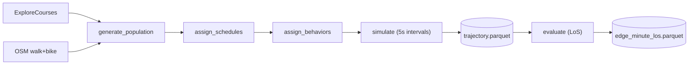
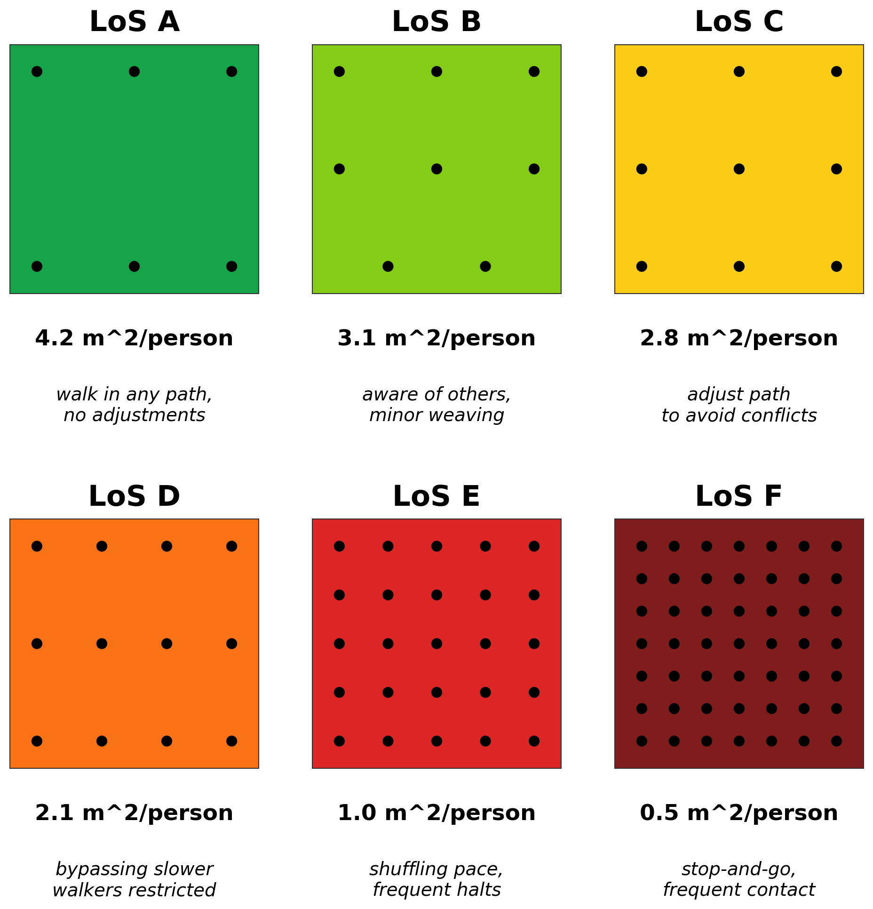
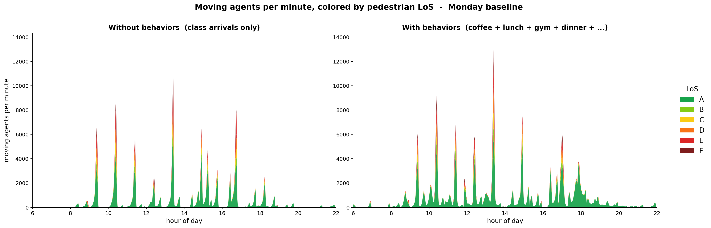
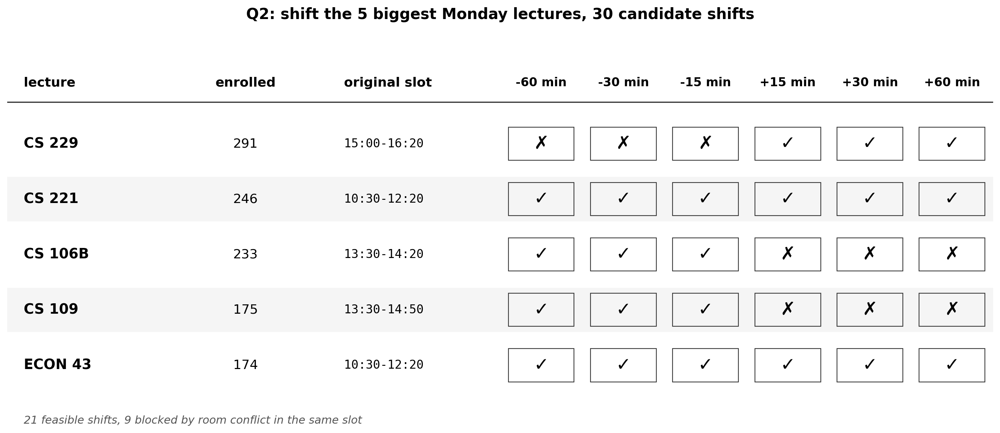
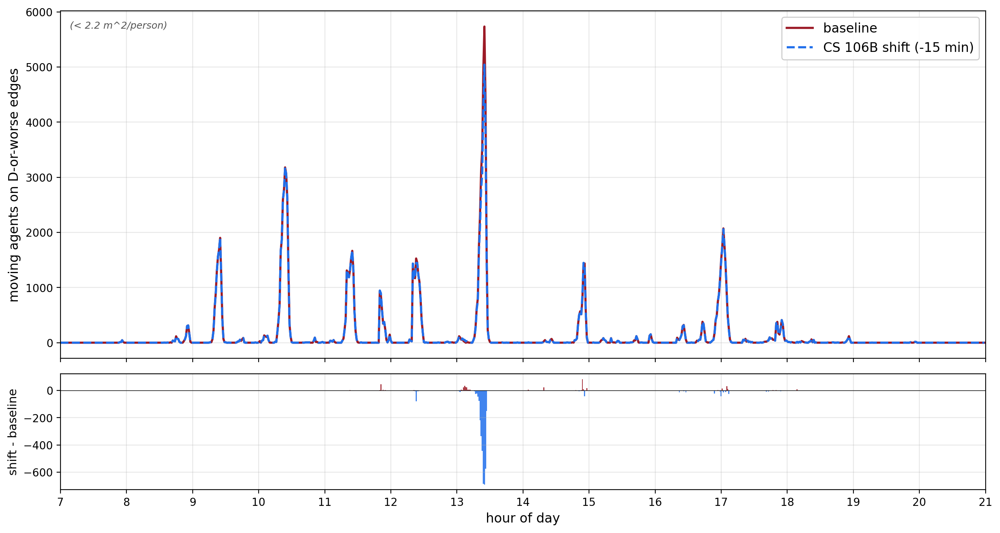
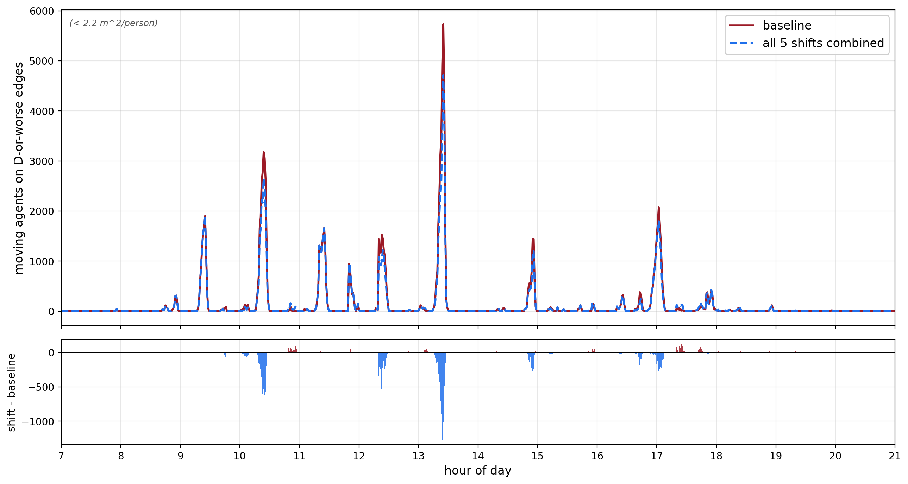

# Campus Cluster - Final Writeup

**Dina Hashash** · hashash@stanford.edu
**CS348K · Visual Computing Systems · Spring 2026**

---

## Background and Setup

Every weekday, thousands of students cross Stanford's campus on a 50-minute passing-period cadence. The question I wanted to answer is: **can shifting a small number of class start times measurably decongest campus?** And before answering that, I needed a simulator detailed enough to tell me *where* and *when* campus actually jams.

**Inputs**
- Stanford's real Spring 2026 course catalog from ExploreCourses (section, room, days, start/end time, enrollment).
- The Stanford walk + bike OSM path network, composed into a single graph with mode flags.
- Stanford undergraduate housing data: dorm capacities and year eligibility.
- Stanford school distribution: percentage of a graduating class that falls within a certain school (Engineering, Humanities, etc).

**Output** For every minute of a simulated weekday, the pedestrian Level of Service (LoS, m²/person) on every path edge, and the total number of moving agents campus-wide.

**Hypothesis** A targeted schedule intervention, shifting at most 5 of the largest lectures by ±15, ±30, or ±60 minutes, can reduce the day's worst peak by **≥20%**, without creating a *new* peak that exceeds 80% of the original. The 20% threshold was chosen as a 20% drop in agents on a congested edge means 25% more square meters per person for everyone still on it (since m²/person is inversely proportional to count). That's a meaningful improvement in comfort, and enough of a difference to move an edge sitting near an LoS boundary up a tier. The second clause, no new peak above 80% of original, exists because otherwise the "solution" is just sliding the peak somewhere else.

**The design challenge** of the project turned out to be the behavior layer between the simulator and schedule shifter. A schedule-only simulator says students walk to class, sit there, and walk home. Under that model campus barely moves, and distributions of congestion are not realistic. Movement outside classes and changes in peaks are caused by meals, coffee, gym, and other rest/study behaviors. A difficult task was deciding what limited behaviors to model to have the most realistic impact on movement, and how to make them per-agent and per-day.

---

## Approach

The system is a six-stage pipeline. The first five stages build the simulated day, and the sixth scores it.

**Population** ([pipeline/generate_population.py](pipeline/generate_population.py)). 6,700 undergraduates: roughly Stanford's enrollment, each with a class year, a school/major bucket drawn from Stanford's reported school distribution, a dorm assigned by year-eligibility and real housing capacity, and a travel mode sampled from a campus-wide distribution (25% walk, 70% bike, 5% electric).

**Schedules** ([pipeline/assign_schedules.py](pipeline/assign_schedules.py)). A senior-priority student-driven matcher fills 12–20 units per student with weighting by `(school × course-level)`, capped at real enrollment numbers from this Spring. Outputs a per-student list of `(section, building, days, start, end)` tuples.

**Routing graph and path computation** ([sim/graph_loader.py](sim/graph_loader.py), [sim/runner.py](sim/runner.py)). Stanford's OSM walk and bike networks are pulled via OSMnx, then composed into a single NetworkX `DiGraph` with `walk_ok` / `bike_ok` edge flags. Per-trip routes are shortest-distance computed with NetworkX's Dijkstra (`single_source_dijkstra`), one cache per source node per mode. Edge weights are mode-specific: walkers see edge length on walk-accessible edges and infinity elsewhere; bikers see edge length on bike-accessible edges and `length × WALK_ON_BIKE_PENALTY` on walk-only edges (so a biker will dismount and use a walk path if it's the only option, but routes around it when possible). Paths are precomputed once per source-mode pair and reused across the day.

**Simulator** ([sim/runner.py](sim/runner.py)). A 5-second-tick state machine per agent: `home → moving → in_class → between → done`. At every tick, each moving agent advances along its current edge by `(speed × dt)`. On arrival it pops the next edge from its per-trip path. One simulated weekday produces ~77.2M trajectory rows (6,700 agents × 16 h × 12 ticks/min).

**Congestion eval** ([eval/congestion.py](eval/congestion.py)). Bucket trajectory samples into `(edge, minute)` pairs, count agents on the edge per bucket, and compute m²/person = `(edge_length × 2m path width) / n_agents`. LoS tiers: A ≥3.7, B 2.8–3.7, C 2.2–2.8, D 1.5–2.2, E 0.7–1.5, F <0.7. Three baseline checks (empty trajectory, single agent alone, fake crowd of 250 on one 50m edge) all pass.

### The behavior layer

[pipeline/assign_behaviors.py](pipeline/assign_behaviors.py) gives each student per-day decisions across six activity types: **coffee, lunch, library, home rest, gym, dinner**. Three design choices matter:

1. **Per-agent, per-day, not per-population.** Every student carries a set of favorite eateries, dining halls, coffee spots, and gyms, sampled once with weights inversely proportional to distance from their dorm. Their lunch decision on a given day picks from their personal set, not from a campus-wide distribution. This means the same student doesn't bounce to a random different cafe daily, distributions tend to cluster around their dorms.
2. **Time-budget gating.** Each behavior has a minimum gap requirement: walk-there + activity + walk-back + buffer. If a student's class-to-class gap is too short for lunch to fit, lunch doesn't happen. This is what makes the simulator's results dependent on the actual class schedule, not just on a population-level lunchtime distribution.
3. **The behaviors aren't tuned to match a target.** I picked plausible time budgets and preference weights once (like the amount of time it takes someone to eat lunch), then left them alone. The behavior layer is meant to expose *whether* schedule shifts can move the peak, not to claim it's quantitatively calibrated. Validation (in the next section) shows how close this simulation ended up being.

I considered making the agents learned policies (RL / LLM) instead of rule-based, and decided against it due to scope constraints as well as my goal for this to model students realistically instead of having agents that optimize.

### The shift optimizer

[pipeline/q2_optimizer.py](pipeline/q2_optimizer.py) takes the 5 highest-enrolled lectures meeting on the target weekday, applies each of six shifts (±15, ±30, ±60 min) to each lecture, and re-runs the full simulator on each candidate. Two things that came up in this process:

- **Cross-listings.** CS 229 / STATS 229 are the same class. Without collapsing them, the conflict checker flagged STATS 229 as blocking positive shifts of CS 229. To fix, I collapsed sections sharing exact `(building, days, start, end)` to one class.
- **Conflict handling.** If a student's *other* class overlaps the shifted slot by less than 20 minutes, they attend partially (the simulator shaves 20 min off the side of the overlap). If overlap is ≥ 20 minutes, the simulator treats it as a full skip, assuming the student watches the recorded lecture later instead. The top 5 Monday lectures targeted are all routinely recorded, which makes this assumption reasonable for this experiment.

### What I started with vs. what I built

**Started with:** OSMnx for the OSM walk+bike queries, NetworkX for graph storage and routing, pandas/numpy/matplotlib for everything tabular and visual.

**Built:** the ExploreCourses scraper, population generator, schedule matcher, behavior model, simulator state machine, congestion evaluator, shift optimizer, and visualizations.

### What didn't work the first time

- **A shared path-cache list** was being mutated by `agent.path.pop(0)` during traversal, so every agent on a popular route drained the cached trip for everyone else.
- **The "same-OSM-node fast path"** was firing from the `home` state, so agents whose dorm and first class snapped to the same OSM node teleported to class instead of walking. Fix: only allow the fast path between non-home states.
- **30-second sampling** turned out to under-count edge crowding by ~6× compared to 5-second. I was running with `dt=30s` for an early checkpoint to save time, saw "0 LoS-D edges" results, and fixed it when running at `dt=5s`. I ended up setting on sampling at 5s for the final results.

---

## Evaluation and Results

### Success criteria

Restating the two goals from the project proposal:

1. **The simulator produces a plausible campus pattern**: peaks at passing periods, near-zero overnight, no flow when no one's moving. The baseline checks should pass, and qualitatively the busiest predicted spots should look like Tresidder / Main Quad / engineering quad.
2. **At least one feasible ≤5-lecture shift achieves ≥20% peak reduction**, without creating a new peak above 80% of the original.

### Experimental setup

All numbers below come from one simulated Monday (Spring 2026 schedule), 6:00 AM – 10:00 PM, 5-second simulator intervals, 6,700 agents, run locally on my laptop. Each shift candidate is a separate full re-run of the simulator on Monday with the modified schedule. The baseline run produces ~77.2M trajectory rows, written to parquet, and each candidate run produces another full set.

The metric I want to optimize is the worst single-minute count of agents on D-or-worse edges. LoS tiers are from the Highway Capacity Manual:

Three baseline checks that passed: an empty trajectory produces zero congestion, a single agent walking produces zero congestion, and a fake crowd of 250 agents placed on a single 50m edge for one minute is correctly detected as LoS F at that minute.

### Q1 - Where and when does campus become congested?

The simulated Monday peaks at 5,733 moving agents on LoS-D-or-worse edges at 13:25 PM. The congestion shape of the day matches roughly what's expected: quiet overnight, increasing at 9:30 AM passing period, denser between 11 and 2, secondary peaks at 3 PM and 5 PM, and falling off after 7 PM. The 1:25 peak is the collision of the 1:30 PM class transition with the end of the lunch wave.

The day's congestion is created by *outside-class behavior* in combination with class schedules:

The left panel is the same simulator without behaviors: agents just walk to class, sit, and walk home. Total D-or-worse minutes are lower by ~19% (95,352 vs 117,947 agents on D-or-worse minutes), and the 13:25 peak is reduced by ~28% (5,733 to 4,104). The right panel is the full simulation. Same schedule, same students, same routing - the only difference is that students leave the classroom for lunch, coffee, the gym, and dinner. The 1:25 peak grows by ~40% with behaviors on.

A single-minute snapshot at 17:02 makes the difference clear: with behaviors off, only 15 edges across campus have pedestrian traffic, but with behaviors on, 926 do. A schedule-only simulator wouldn't be able to see what causes evening congestion without behaviors, because dinner doesn't exist in that world.

The full simulated day plays back here ([click to watch](report/figures/congestion_map_smooth.mp4), ~78 sec at 30 fps, 7 AM – 8 PM clamp). Edges are colored by LoS.

### Q2 - Can ≤5 lecture shifts reduce the peak ≥20%?

The five Monday lectures with the most enrollments cover 1,114 enrollments across 961 distinct students — the gap is from students enrolled in two or more of the five (e.g. CS 229 and CS 221). Across them I tested 30 candidate shifts (5 lectures × 6 deltas), 21 of which are feasible after accounting for room conflicts:

The 9 infeasible cells are real room conflicts in Spring 2026's schedule: for example, CS 229 can't shift earlier because CS 109 in NVIDIA Auditorium (1:30–2:50 PM), and CS 106B can't shift later because CS 106A is in Hewlett 200 right after at 2:30–3:20 PM.

**Best single shift: CS 106B −15 min.** This shift moves 106B from 1:30 to 1:15. The day's peak drops from 5,733 to 5,042, **−12.1%**. There is also no new peak above 80% of the original (the largest new "spike" is +83 agents at 14:54). The reduction from this shift is short of the −20% goal.

Reading the top panel: solid red is the baseline, dashed blue is the shifted run, both are showing agents on D-or-worse edges over the day. The bottom panel is the per-minute difference (shift − baseline). The large blue dip at 1:25 is the savings, which is 691 agents off the worst edges at that time. The few small red bars are new (small) increases in congestions caused by CS 106B starting at 1:15 instead of 1:30, and dismissing at 2:05 instead of 2:20. They're small because the new times don't coincide with other large class transitions.

**Best combined-5 shifts.** Stacking the best per-lecture shifts: CS 106B −15, CS 109 −15, CS 221 +30, ECON 43 +30, CS 229 +60. The peak drops from 5,733 to 4,717, **−17.7%**. Still short of −20%.

The combined plot's difference panel shows larger, and more blue dips: the 1:25 one is larger than in the run with a single shift, and there are added savings between 10:30 and noon (ECON 43 and CS 221 originally both meet 10:30–12:20, so pushing them to 11:00 thins the morning passing period too). The red bars at the new transition times are still well below the 80% new peak constraint.

#### Why the goal wasn't met

The lever itself works: every feasible shift moves the peak in the right direction, and adding each shift on top of a previous helps. But the reach of ≤5 lectures is too narrow.

Of the 3,765 distinct students moving at 13:25 (this counts each person once, the 5,733 sums across all D-or-worse edges and counts each person per congested edge they cross in that minute), only 743 had any class moved within the 11–2 lunch window where the peak actually lives. That's ~20% of the moving population. Also, 173 distinct Monday lectures overlap in the 11–2 window. Of my five top-5 lectures, only four are in this window, so my experiment moved 4 of the 173 lunch lectures (~2.3% of them). The 1:25 peak is caused by class transitions, and worsened by thousands of lunch trips happening at once. So to solve this issue, you would need to spread out the times people are going to class, which also changes the times they go to lunch.

### Field validation

After the Q2 results, I went out and hand-counted pedestrians at the middle of Jane Stanford Way. The simulator predicts this path as a congested edge during passing periods. The most significant of those peaks are at the 10:30 and 1:30 transitions on a Monday.

**Morning count (10:20 to 10:30, per minute):** 17, 18, 30, 26, 26, 31, 52, 38, 46, 47, 46.

**Afternoon count (1:20 to 1:30, per minute):** 12, 31, 36, 45, 50, 77, 45, 60, 60, 59, 43.

**Timing matches within ~1 minute.** Morning sim peaks at 10:25 (190); field peaks at 10:26 (52). Lunch sim peaks at 13:26 (191); field peaks at 13:25 (77). Sim is one minute early in the morning and one minute late at lunch.

**Magnitude is off by ~3-4x.** The simulator predicts ~190 distinct agents at this edge during the morning peak, and the field count was 52. The afternoon peak is 191 vs 77. Three possible causes, in roughly the order I'd expect them to contribute:

1. **Routing convergence on Jane Stanford.** It's everyone's east-west shortest path in the simulator, but in reality students go across other routes.
2. **End-of-year attendance.** I validated June 1, with classes ending a couple days after. Attendance late in the quarter is likely a lot lower than average.
3. **All 6,700 undergrads show up every Monday in the simulator.** In reality, there are absences.

**Arrival extends past class start.** Separately from magnitude, the morning count keeps rising past 10:30, and a non-trivial fraction is still moving at 10:29 and 10:30, with wave only really dying down past ~10:35. The simulator assumes students mostly arrive on time.

So: shape and timing are right, magnitude over-predicts by 3-4x, and the arrival distribution is too narrow. The mechanism the simulator describes is sound; the calibration has real and identifiable gaps.

### What this all says

Going back to the success criteria:

1. **Plausible campus pattern: yes.** Peaks at passing periods, lunch crowd, dinner wave, baseline checks pass, validation found a wave at the predicted spot at the predicted minute (give or take one).
2. **≥20% peak reduction: no.** The best result is −17.7% from combining five shifts; best single shift is −12.1%.

Limitations:

- **Lever scope.** ≤5 lectures reaches 743 of 3,765 peak-time movers. Looking forward: more lectures shifted to spread across a longer time.
- **On-time arrival assumption.** Validation showed real arrivals go way past the start of class. Looking forward: change the distribution of buffer a student leaves before class to include more late arrivals.
- **Missing populations.** Currenly there are only 6,700 undergrads. To add: ~10k graduate students, few thousand faculty/staff, and athletes on practice schedules (and maybe the big tour/tourist group every so often). 
- **Missing behaviors.** Friend interactions, coffee chats, and trips that aren't driven by class schedule (students leaving their dorm even without classes) all create movement the current model doesn't include.
- **Fixed path width.** Every edge uses a 2m width to compute m²/person. Actual Stanford paths likely are a range between ~2m to ~6m+ (main thoroughfares like Jane Stanford Way), so the LoS is biased toward more congestion than reality. The shift-comparison ranking is robust to this because every run uses the same width, but the magnitudes (like −12.1%, −17.7%) would shift if widths were calibrated per-edge. Looking forward: tag edges with measured widths.

---

## Team Responsibilities

Solo project.

---

## References

1. **Transportation Research Board (2010).** *Highway Capacity Manual, 5th Edition.* pedestrian Level of Service thresholds and descriptions used in [eval/congestion.py](eval/congestion.py).
2. **Boeing, G. (2017).** *OSMnx: New methods for acquiring, constructing, analyzing, and visualizing complex street networks.* Used to query Stanford's walk and bike networks from OpenStreetMap.
3. **OpenStreetMap contributors.** Stanford campus walk and bike networks. https://www.openstreetmap.org
4. **Stanford ExploreCourses.** Spring 2026 course catalog. https://explorecourses.stanford.edu - scraped using [scrapers/scrape_courses.py](scrapers/scrape_courses.py).
5. **Stanford Undergraduate Majors.** School and major distribution used to weight population generation. https://majors.stanford.edu/majors
6. **Stanford Residential & Dining Enterprises.** Undergrad dorm capacities and year eligibility, used in [pipeline/generate_population.py](pipeline/generate_population.py).
7. **NetworkX** - graph storage and shortest-path routing via `single_source_dijkstra`.

